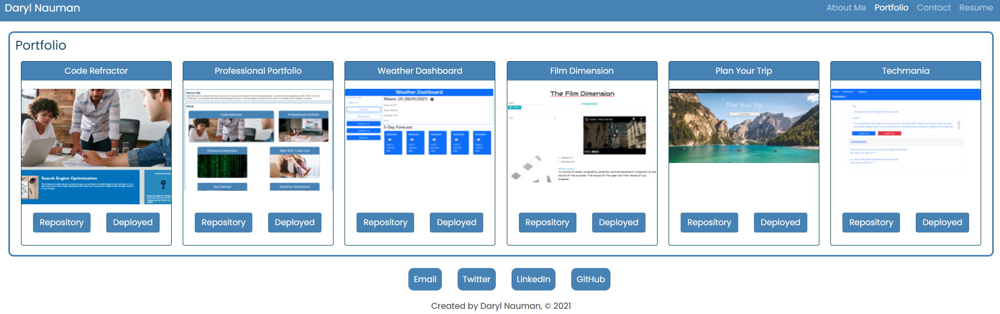

# Porfolio

## Table of Contents
[Description](#description)  
[Key Features](#key-features)  
[Technology Used](#technology-used)  
[Links](#links)  
[Screenshots](#screenshots)  
[Questions](#questions)  
[License](#license)  

## Description
This was originally a homework assignment for the University of Toronto SCS Coding Boot Camp. This is my portfolio created using React. React is a popular JavaScript library for building user interfaces. This application is deployed on Heroku.

## Key Features
- This application is contained within a single-page
- When a user clicks on a navigation item that section is presented without the page reloading and the navigation item is highlighted
- Application has a mobile friendly, responsive, and clean design including a collapsing navigation bar
- Portfolio projects are displayed through the use of a project component that is reused as the application maps through an array of projects
- The application includes several React components such as a header, navigation bar, project card and footer
- The styling is mainly managed through CSS files for each component and some Bootstrap
- Contact page form (currently under revision) ensures the user enters a valid email address with the help of a regular expression
- Contact page form (currently under revision) notifies the user that an input field is required if they enter and then leave it blank
- The styling of items in the footer change on mouse over by the user

## Technology Used
- React
- HTML, CSS, JavaScript
- Bootstrap
- NPM packages of note: react, react-router-dom

## Links
- [GitHub repository](https://github.com/darylnauman/react-portfolio)
- [Deployed application](https://darylnauman.herokuapp.com/)

## Screenshots
### About Me Component Displayed

### Portfolio Page and Project Components Displayed

## Questions
If you have any questions, please contact me (see my profile), I am happy to answer them.

## License
This product is under the MIT License.
